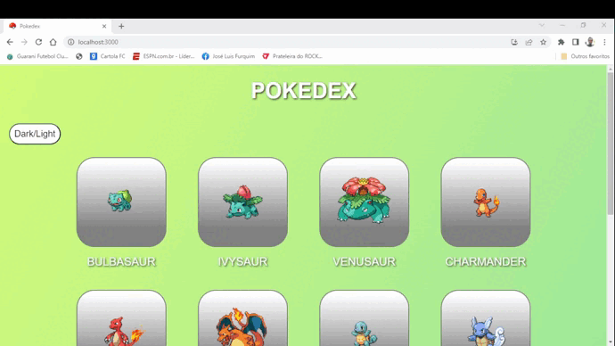

# Pokédex via React

Este projeto foi criado em resposta aos desafios de teste técnico do curso de desenvolvimento front-end DevQuest na categoria de React Avançado. Inclui uma simulação do Pokedex, exibindo os objetos do Pokémon na página inicial e uma página contendo o próprio Pokedex e uma descrição do Pokémon selecionado.

## Descrição 
- A aplicação é renderizada inicialmente com 10 pokémons solicitados da API, tem um botão para alternar entre o tema claro/escuro, há um botão logo abaixo da lista para adicionar mais pokémons, as atualizações da lista são sempre para ela Adicionar 10 Pokémon.
- Cada Pokémon possui um link para sua página individual com seu tipo e botões para você escolher se deseja ver suas habilidades ou golpes.
 

## Aplicação

### Desafio do projeto

- Durante o desenvolvimento, eu tive bastantes dificuldades de renderizar na tela. A api
me pareceu complicada no inicio e eu tive re rever bastante do conteudo de react para começar o projeto. Pedi ajuda a um amigo (obrigado Gabriel pois ele tem mais conhecimento sobre React do que eu e me ajudou bastante na correção dos erros encontrados que eu cometi e me sugeriu mudanças) na parte de detalhar as informações dos pokemons (details-pokemons.js), pois estava com problemas na hora de clicar na imagem do pokemon e aparecer as informações (simplesmente nao funcionava) e o erro esta nas declarações, que eu nao tinha colocado o nome correto da Api.

- E na escolha das cores eu quis implementar um pouco do linear-gradient do CSS e 
tentar imitar a paleta de cores do jogo Fire Red e Leaf Green da franquia pokemon.
Tambem utilizei o https://www.flaticon.com/free-icons/pokemon para os icons que descobri isso por pesquisas relacionados ao conteudo proposto. Só nao consegui fazer os pokemons se mexerem como é em umam pokedex.

## Habilidades requisitadas para o desafio

- REACT
- JS
- Context.API (https://pokeapi.co/)
- Styled Components
- React Router DOM

## Como rodar o projeto
- Para instalar os pacotes `npm install`

- Para inicializar o projeto `npm start`